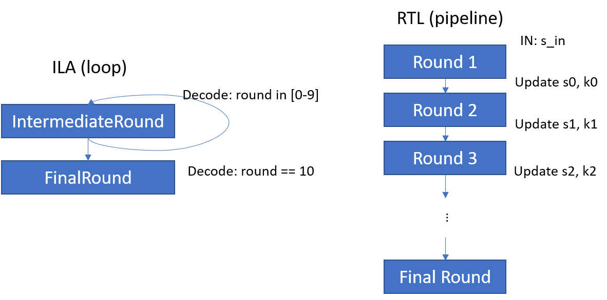
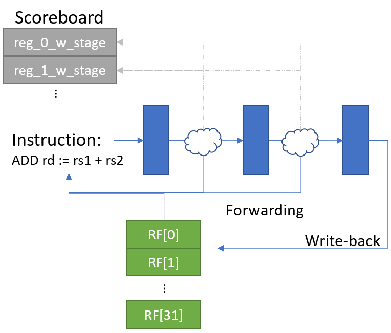
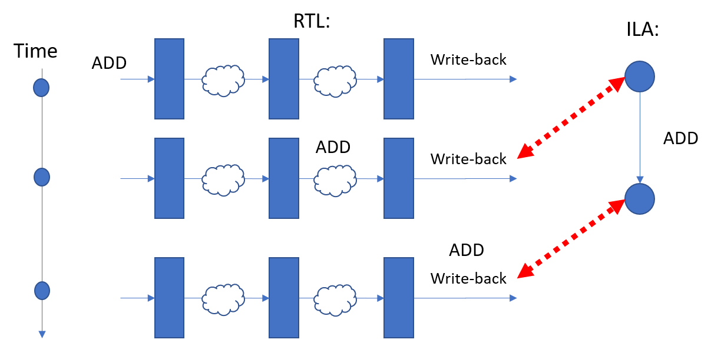

# Examples

Here we'd like to give some examples of the refinement relations. The features described may include some of the syntactic sugar we are currently working on, which will be marked in the text.

## Conditional Mapping

In variable mapping section, the conditional mapping is helpful in many cases. Below we give some examples using conditional mapping.

### Mapping Loop Body with Unrolled Pipelines

Suppose we have a specification for AES-128 function, which consist of 10 rounds of cryptographic operations, each round takes results from previous round and generate new ciphertext and new round key which will be used in the next round. In the ILA model, this is described with the help of child-instructions that form a loop. Whereas, the implementation is a pipeline which corresponds to an unrolling of the loop in the specification. This is illustrated in the figure below.



When verifying the child-instructions, we need to map the state variables holding intermediate results \(suppose it is named as `ciphertext` in ILA\) with signals in Verilog. However, because the loop is unrolled into a 10-stage pipeline, the corresponding Verilog signal for `ciphertext` is dependent on the round. Therefore, we need conditional mapping here, which can be specified as follows.

```javascript
  "state mapping": {
    "ciphertext" : [["ILA.round == 0", "s_in" ],
                    ["ILA.round == 1", "s0"   ],
                    ["ILA.round == 2", "s1"   ],
                    ...
                   ]
  }
```

Or, alternatively, you can use:

```javascript
  "state mapping": {
    "ciphertext" : [{"cond":"ILA.round == 0", "map":"s_in" },
                    {"cond":"ILA.round == 1", "map":"s0"   },
                    {"cond":"ILA.round == 2", "map":"s1"   },
                    ...
                   ]
  }
```

Regarding the `round` variable in ILA, because the loop in Verilog is fully unrolled and the effects of `round` are already reflected in the mapping of `ciphertext`, we don't need a mapping for `round`. We can simply write:

```javascript
  "state mapping": {
    "round" : null,
    ...
  }
```


The condition are treated as a ordered list, namely, only when the first condition does not hold, will the rest of the mapping be considered. You can have a default case with condition `1'b1` or `null`.


### Mapping State Variables with On-the-Fly Values

When tackling pipelined designs, for a software-visible state variable \(e.g., an architectural register\) it is also common that there might be multiple places to look for, especially the value on-the-fly inside the pipeline. Because of forwarding logic, a newly computed value, though not yet written back to the register file, can still be observable for an instruction following it. In the refinement relation, we provide two possible ways to handle the case: conditional mapping and light-weight flushing.



**Conditional mapping.** Usually, inside the pipeline, there are book-keeping logic to track the location of the latest update to an architectural register \(e.g., the scoreboard\). Therefore, one can use this logic to map an architectural register to the corresponding microarchitectural register in the pipeline. Above shows an examples of such a pipeline, it has three stages \(not counting the stages before instruction dispatch\) and a per-register record `reg_X_w_stage`. The left-most bit indicates if the EX \(execute\) stage has a valid write to register X. The right-most bit indicates if the second stage has a write. Based on status indicated by this scoreboard, one can write the refinement for the register as below. It first checks the left-most bit of the scoreboard entry and then the right-most bit and finally the default case. Note how the priority list is used for condition.

```javascript
  "state mapping": {
      ...,
    "r1" : [ {"cond":"m1.reg_1_w_stage[1]", "map":"ex_alu_result"},
             {"cond":"m1.reg_1_w_stage[0]", "map":"ex_wb_val"},
             {"cond":null, "map":"register[1]"}  ],
    "r2" : [...],
    ...
  }
```

**Light-weight flushing.** This is a setting similar to what has been used in ARM's ISA-Formal work. One can use prophecy variables \(variables holding values available in the future\) to help construct the mapping. The value-on-the-fly will be written back to the architectural register file in the future and we can map a register with that future value. Our variable mapping allows this mapping using what we call "value holder" \(it is essentially an auxiliary variable and note that it can also hold history values\). The light-weight flushing setting is illustrated in the figure below:



Again for the previous pipeline example, we can have the variable mapping as follows:

```javascript
  "state mapping": {
      ...,
    "r1" : [ {"cond":"__START__", "map":"#valueholder_r1#"},
             {"cond":"__IEND__", "map":"register[1]"}],
    "r2" : [...],
    ...
  }
```

Here `#` quoted names are the names to value holders. The condition `__START__` indicates, at the beginning of the instruction under verification, `r1` is mapped to the value holder \(a future value in our case\) and at the end of the instruction execution \(indicated by `__IEND__`\), it is mapped to the write-back value in the register file.

Value holders are defined in the `value-holder` section in the variable mapping file. Below is an example. The condition here indicates when to take the value of `m1.register[1]` and hold it for use universally. `stage_tracker` is an example of the monitor that one may add to track the stage of an instrcution in the pipeline \(if the original design already has some tracking mechanism, it can be used instead\).

```javascript
"value-holder": {
  "valueholder_r1":{
     "cond" : "stage_tracker == 1", // Commit point of the previous instruction
     "val"  : "m1.register[1]",
     "width": 8
  }
}
```


`width` in the above example can be set to `"auto"` which will allow the tool to automatically determine the width of the value holder.



We are working on a syntactic sugar in the form of `val@cond` in the `state-mapping` part which can automatically generate a value holder. In the future we shall allow the following shortcut:

```javascript
  "state mapping": {
      ...,
    "r1" : [ {"cond":"__START__", "map":"register[1] @ (stage_tracker == 1)"},
             {"cond":"__IEND__", "map":"register[1]"}],
    "r2" : [...],
    ...
  }
```


## Stage Tracker

As shown by the previous example, it is very often that one would like to track the stage of an instruction. Currently this is done via inline Verilog monitors. For the previous example, we have a monitor like the following.

```javascript
  "verilog-inline-monitors" : {
    "stage_tracker" : {
      "verilog": 
        ["always @(posedge clk) begin",
         "  if (__START__) stage_tracker <= 0;",
         "  else if (__STARTED__ && !__ENDED__) stage_tracker <= stage_tracker + 1;",
         "end"],
      "defs" :[ ["stage_tracker", 2, "reg"] ],
      "refs" :[]
    }
```

This monitor starts the tracking when the instruction under verification starts to execute and counts up till the instruction finishes. This works for the simple case as the pipeline will not stall and the tracker does not need to stall either. However, in general this is not true and below we provide an example to handle a more general case.

In the example below, there are 3 intermediate stages and a final write-back \(s4\) stage. The monitor here uses the signals inside the pipeline like `m1.s1_to_s2$D_IN` and `m1.s1_to_s2$EN` to tell if the current instruction moves to the next stage. These are indicated by the signals like `s1_to_s2`.

```javascript
 "verilog-inline-monitors" : {
    "stage_tracker" : {
      "verilog": 
        [
          "wire s1_begin =  m1.stage1_rg_full;",
          "wire s1_to_s2 =  m1.s1_to_s2$D_IN & m1.s1_to_s2$EN;",
          "wire s2_to_s3 =  m1.s2_to_s3$D_IN & m1.s2_to_s3$EN;",
          "wire s3_to_s4 =  m1.s3_deq$EN & m1.s3_deq$D_IN;",
          "always @(*) begin monitor_s1 = s1_begin & ~monitor_s1_already & __START__; end",
          "always @(posedge clk) begin",
          "    if(rst)",
          "        monitor_s1_already <= 0;",
          "    else if (monitor_s1 && monitor_s2_nxt)",
          "        monitor_s1_already <= 1;",
          "end",
          "always @(*) begin monitor_s2_nxt = (monitor_s2 == 0) ? ( s1_to_s2 & monitor_s1 ?  1'b1 : 1'b0) : ",
          "  ( s2_to_s3  ?  1'b0 : 1'b1); end",
          "always @(posedge clk) begin",
          "    if(rst) begin",
          "        monitor_s2 <= 0;",
          "        monitor_s2_already <= 0;",
          "    end",
          "    else begin",
          "        monitor_s2 <= monitor_s2_nxt;",
          "        if (monitor_s2 & monitor_s3_nxt)",
          "            monitor_s2_already <= 1;",
          "    end",
          "end",
          "always @(*) begin monitor_s3_nxt = (monitor_s3 == 0) ? ( s2_to_s3 & monitor_s2 ?  1'b1 : 1'b0) : ",
          "  (s3_to_s4 ? 1'b0 : 1'b1) ; end ",
          "always @(posedge clk) begin",
          "    if(rst) begin",
          "        monitor_s3 <= 0;",
          "        monitor_s3_delay <= 0;",
          "    end",
          "    else begin",
          "        monitor_s3 <= monitor_s3_nxt;",
          "        if (monitor_s3)",
          "            monitor_s3_delay <= 1'b1; // enough",
          "    end",
          "end",
          "always @(*) begin monitor_s4_nxt = ",
          "  monitor_s3 && s3_to_s4 ? 1'b1 : monitor_s4; end",
          "always @(posedge clk) begin",
          "    if(rst) begin",
          "        monitor_s4 <= 0;",
          "        monitor_s4_delay <= 0;",
          "    end",
          "    else begin",
          "        monitor_s4 <= monitor_s4_nxt;",
          "        if (monitor_s4)",
          "            monitor_s4_delay <= 1'b1;",
          "    end",
          "end",
          "always @(*) begin end_of_pipeline = monitor_s4 && ~monitor_s4_delay ; end // just check one cycle"
        ],
      "defs" :
          [
          ["end_of_pipeline"     , 1 , "reg"]  ,
          ["monitor_s1_already"  , 1 , "reg"]  ,
          ["monitor_s1"          , 1 , "reg"]  ,
          ["monitor_s1_delay"    , 1 , "reg"]  ,
          ["monitor_s2"          , 1 , "reg"]  ,
          ["monitor_s2_nxt"      , 1 , "reg"]  ,
          ["monitor_s2_already"  , 1 , "reg"]  ,
          ["monitor_s3"          , 1 , "reg"]  ,
          ["monitor_s3_nxt"      , 1 , "reg"]  ,
          ["monitor_s3_delay"    , 1 , "reg"]  ,
          ["monitor_s4_nxt"      , 1 , "reg"]  ,
          ["monitor_s4"          , 1 , "reg"]  ,
          ["monitor_s4_delay"    , 1 , "reg"]
      ] ,

      "refs" :[
        "m1.stage1_rg_full", 
        "m1.s1_to_s2$D_IN",
        "m1.s1_to_s2$EN",
        "m1.s2_to_s3$D_IN",
        "m1.s2_to_s3$EN",
        "m1.s3_deq$D_IN",
        "m1.s3_deq$EN",
        "m1.rg_retiring$EN" ]
    }// stage tracker
  }
```


As the tracking of pipeline stages is a very common scenario, we are also working on a template to automatically generate a pipeline stage tracker. We expect this to handle the case of branching pipelines \(where there are fan-out points to dispatch instructions through any of the downstream pipelines, and merge point that coalesce the end of multiple pipelines\). Events are specified based on their effects on the stages as `exit` event and `enter` event. We shall also allow caching temporary values in auxiliary variables at the time of the events.


## Simple Delays

Another common scenario is that we'd like to delay a signal for a few cycles. The general way for this is an inline-monitor. For example, we'd like to delay `xram_ack` for one cycle and use it as the finish condition for an instruction. First, we can have a few lines in `verilog-inline-monitors` section as follows:

```javascript
"verilog-inline-monitors" : {
  "xram_ack_delay_1" :  {
      "verilog": [
        "always @(posedge clk) begin xram_ack_delay_1 <= xram_ack; end"
      ],
      "defs" : [["xram_ack_delay_1"     , 1 , "reg"]],
      "refs" : ["xram_ack"]
  }
}
```

Recall that `defs` contains the auxiliary variables that we'd like to create and `refs` are the signals in the original design that we use in the monitor.


We are working on a syntactic sugar in the form of `signal ## cycle` and `(expression) ## cycle` that will create verilog-inline-monitor automatically to delay a signal for the given number of cycles.


## Mapping of Memory

The specification of memory state variable mapping can be very different depends on the types of memory.
The memory in Verilog be internal or external. While the memory in ILA may be modeled as an internal or memory state variable, as well.
There isn't a strict dependency between the two choices. And there are four combinations as described below.

### Internal Memory in both ILA and RTL

Currently, there isn't a uniform and scalable way to handle this case for both Pono and JasperGold.
The current implemented approach is to declare the memory as internal in the annotation section, however, this won't scale to large memory.
Below gives an example.

The implementation contains two internal memories `mema` and `memb`, when `start` signal is asserted, it will swap the contents between two addresses in these two memories, where the addresses are specified by the input indices.

```text
// swap with internal memory (im)
module swap (
  input clk,    // Clock
  input rst,  // Synchronous reset active high
  input [3:0] addra,
  input [3:0] addrb,
  input start);

reg [7:0] mema[0:15];
reg [7:0] memb[0:15];


always @(posedge clk) begin
  if (start) begin
    mema[addra] <= memb[addrb];
    memb[addrb] <= mema[addra];
  end
end
endmodule
```

The ILA model also model these as internal memory state variables and the ILA has only one instruction `SWAP`.

```cpp
  auto memswap = Ila("MemorySwap");
  memswap.SetValid(BoolConst(true));

  auto addra = memswap.NewBvInput("addra", 4);
  auto addrb = memswap.NewBvInput("addrb", 4);
  auto start = memswap.NewBvInput("start", 1);

  auto mema = memswap.NewMemState("mema", 4, 8);
  auto memb = memswap.NewMemState("memb", 4, 8);

  {
    auto SWAP = memswap.NewInstr("SWAP");
    SWAP.SetDecode(start == 1);

    auto dataa = Load(mema, addra);
    auto datab = Load(memb, addrb);

    SWAP.SetUpdate(mema, Store(mema, addra, datab)); //mema[addra] = memb[addrb]
    SWAP.SetUpdate(memb, Store(memb, addrb, dataa)); //memb[addrb] = mema[addra]
  }
```

The mapping of the memories in ILA and Verilog is very straightforward (below only shows the `state mapping` section).

```javascript
  "state mapping": {  
    "mema":"mema",
    "memb":"memb"},
```

This simple handling will work for all backends, but would not scale to large memories.
If it is possible to convert the internal memory to an external one by commenting away the declaration of the Verilog array and the associated read/write logic, then we can use the memory abstraction approach that applies to external memory. (Note in the conversion, please keep the read/write signals intact as they will be treated as if they are interface signals to the external memory, and our tool can automatically pull these signals to the top level module.)



Currently, there is a limitation on the memory abstraction model, which only supports making one read and one write concrete. So, if the internal array is read or written more than twice during the execution of the instruction and they must be concrete to avoid the spurious counterexample due to the abstraction, you might have to consider the commercial solution (the Proof Accelerator in JasperGold, which is essentially a memory abstraction but can be configured to support multiple concrete read and write).



Specifically, for the Pono backend, we are working on a solution to use SMT array theory to support mapping of arrays. However, although no Verilog modification is needed, it might be difficult for the model checkers to prove unbounded correctness.



We are also considering the possibility of intergrating CHC solvers to overcome the above difficulty when handling arrays. Comments and feedbacks on this are greatly appreciated.


### Internal Memory in ILA and External Memory in RTL

Now suppose we want to convert the above Verilog to external memories, we need to comment away the declaration of Verilog arrays as well as the associated read/write logic.

```text
// swap with internal memory (im) (now converted to external memory)
module swap (
  input clk,    // Clock
  input rst,  // Synchronous reset active high
  input [3:0] addra,
  input [3:0] addrb,
  input start);

// reg [7:0] mema[0:15];
// reg [7:0] memb[0:15];


// always @(posedge clk) begin
//  if (start) begin
//    mema[addra] <= memb[addrb];
//    memb[addrb] <= mema[addra];
//  end
// end

endmodule
```

Below shows the signal mapping below. Here it is a bit tricky as in Verilog there is no such signal that holds the output of the 
read from these two arrays (they are directly used to overwrite the contect in another location). So we will need to create auxiliary variables to support this. In the table, we use `#mema_rdata#` and `#memb_rdata#` as the place-holders.

| memory.port 	| signal       	|
|-------------	|--------------	|
| mema.ren    	| start        	|
| mema.raddr  	| addra        	|
| mema.rdata  	| #mema_rdata# 	|
| mema.wen    	| start        	|
| mema.waddr  	| addra        	|
| mema.wdata  	| #memb_rdata# 	|
| memb.ren    	| start        	|
| memb.raddr  	| addrb        	|
| memb.rdata  	| #memb_rdata# 	|
| memb.wen    	| start        	|
| memb.waddr  	| addrb        	|
| memb.wdata  	| #mema_rdata# 	|


The overall state variable mapping should looks like this:

```json
{
  "models": { "ILA":"m0" , "VERILOG": "m1" },
  "instruction mapping": [],
  "state mapping": {  
    "mema":"**MEM**mema",
    "memb":"**MEM**memb"},

  "interface mapping": {
     "rst":"**RESET**", 
     "clk":"**CLOCK**",
     "addra":"addra",
     "addrb":"addrb",
     "start":"start"
  },

  "annotation" : {
    "memory-ports" : {
      "mema.ren"     : "start"         ,
      "mema.raddr"   : "addra"         ,
      "mema.rdata"   : "#mema_rdata#"  ,
      "mema.wen"     : "start"         ,
      "mema.waddr"   : "addra"         ,
      "mema.wdata"   : "#memb_rdata#"  ,
      "memb.ren"     : "start"         ,
      "memb.raddr"   : "addrb"         ,
      "memb.rdata"   : "#memb_rdata#"  ,
      "memb.wen"     : "start"         ,
      "memb.waddr"   : "addrb"         ,
      "memb.wdata"   : "#mema_rdata#"  
    }
  },

  "verilog-inline-monitors" : {
    "read_value_holder" : {
      "verilog": [],
      "defs" :[ ["mema_rdata", 8, "wire"],["memb_rdata", 8, "wire"] ],
      "refs" :[]
    }
  }
}
```

And to aid efficient reasoning, you should also enable `MemAbsReadAbstraction` option in the configuration for `VerilogVerificationTargetGenerator`. An example is given below:

```cpp
  VerilogVerificationTargetGenerator::vtg_config_t  vtg_cfg; // default configuration
  vtg_cfg.MemAbsReadAbstraction =  true; // enable read abstraction in the abstract memory model
  VerilogVerificationTargetGenerator vg( ... /* the arguments are omitted here */ ,
    vtg_cfg); // give vtg_cfg as the extra configuration
```

### External Memory in ILA and Internal Memory in RTL

In this case, you may want to consider to convert the internal Verilog memory as external using the approach described above. This will help with mapping and also the automated reasoning in the underlying model checkers.

### External Memory in both ILA and RTL

In this case, you can try to map the directly interface signals between ILA and RTL, if 
you are unable to write it as an one-to-one mapping in `interface mapping` section, `mapping control` section is available for you.


